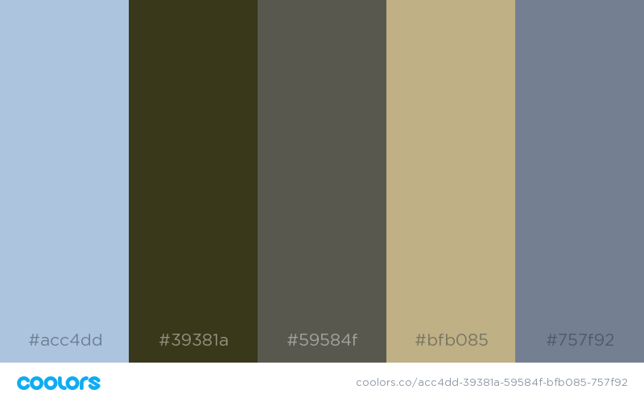

# Project Proposal


**Title:** Beetle and Wildfire Interactions: Insights from British Columbian Forests

**Group Members:**

- Michael Cook
- Dominique Bachelet
- Anna Talucci

**Motivation:**

- Across central interior British Columbia, Canada, nearly 20 million hectares of lodgepole pine dominated forested have been affected by high rates of tree mortality cause by the most recent mountain pine beetle outbreak (circa 1999). Forests are an integral part of the landscape providing wildlife habitat, ecosystems services such as carbon sequestration, economic value in terms of timber harvest and recreation. 
- The magnitude of mass mortality associated with beetle outbreak has been so extensive that wildfires are burning through forests that have been dead for over a decade. Dead forest burn differently then live forests. Dead forest burn more severely in terms of coarse woody biomass consumption. 
- Lodgepole pine move through the postmortem decay phases after beetle attack. Trees transition to the red phase characterized by a canopy of red needles, and then drop their needles and transition to the gray-phase, characterized by snags. By the gray-phase seedbanks are reduced by 45% through cones opening, cones falling to the ground, and predation.

**Project Description**

- Generate a storymap to describe interacting effects of sequential disturbances of beetle outbreak and wildfire on fire severity and forest recovery for central interior British Columbian Forests. .

**Data:**

- In this repository there is an image file with a sample of photos
- Aerial video footage might be available
- Some field data could potentially be integrated
- Remote sensing analysis from google earth engine platform (see file GEE_sample)
- Spatial data could include: fire perimeters, provincial park boundaries, biogeoclimatic zones, tree species (spatial data file only includes fire perimeters for now)

**Interface Design:** Storymap

- **[2018 Bark Beetle Forecast for California](https://usfs.maps.arcgis.com/apps/MapJournal/index.html?appid=7b78c5c7a67748808ce298efefceaa46)**
- **[Forests of Utah, 2015](https://usfs.maps.arcgis.com/apps/MapJournal/index.html?appid=9bb22eed68944e1e89cca9e5eea8339d)**
- **[Forest Inventory and Analysis Annual Reporting, States](https://usfs.maps.arcgis.com/apps/PublicGallery/index.html?appid=bb59566ba3574c92aa04038aed91276b)**

**Interface Sketch:**

## Beetle and Wildfire Interactions: Insights from British Columbian Forests

### Project Outline and Story Map Sketch

<p> This is the basic outline for our groups final Storymap presentation on the correlation between beetle infestation and natural wildfire disturbance events in Western Canada. We have included ideas on geovisualization tools to be used in this presentation. This outline is subject to changes throughout our work as we find and learn new tools to best visualize our data.</p> 


  


### Design Scheme

#### 1. Color Scheme

We generated out color scheme using a photograph in coolors.co

 


Then used coolors.com.

**[Color Scheme](https://coolors.co/export/png/acc4dd-39381a-59584f-bfb085-757f92)**




#### 2. Font

```javascript
<link href="https://fonts.googleapis.com/css?family=Source+Sans+Pro" rel="stylesheet">
```


```javascript
 <style>
        body {
            font-family: 'Source Sans Pro', sans-serif; font-size: 22px;
            }
    </style>
```


```javascript
<!DOCTYPE html>
<html>
<head>
    <title>Font Template Page</title>
   <link href="https://fonts.googleapis.com/css?family=Source+Sans+Pro" rel="stylesheet">
    <style>
        body {
            font-family: 'Source Sans Pro', sans-serif; font-size: 22px;
        }
    </style>
</head>
<body>

<h1>Source+Sans+Pro</h1>
<p></p>


</body>
</html>
```


#### 3. Icons

Icons to include: envelope for email, search, print, and comment 

```javascript
<p>Envelope icon: <span class="glyphicon glyphicon-envelope"></span></p>
<p>Search icon: <span class="glyphicon glyphicon-search"></span></p>
<p>Print icon: <span class="glyphicon glyphicon-print"></span></p>
<p>Comment icon: <span class="glyphicon glyphicon-comment"></span></p>
```


#### 4. Multi-Media


Potential aerial videos take after beetle outbreak and wildfire (not sure if these are worth using?)

[Aerial video 1](https://photos.app.goo.gl/xIjDaLALEotYM7bY2)

[Aerial Video 2](https://photos.app.goo.gl/yH1S7yELVgiFCQNq6)


Potential aerial shot for first page


